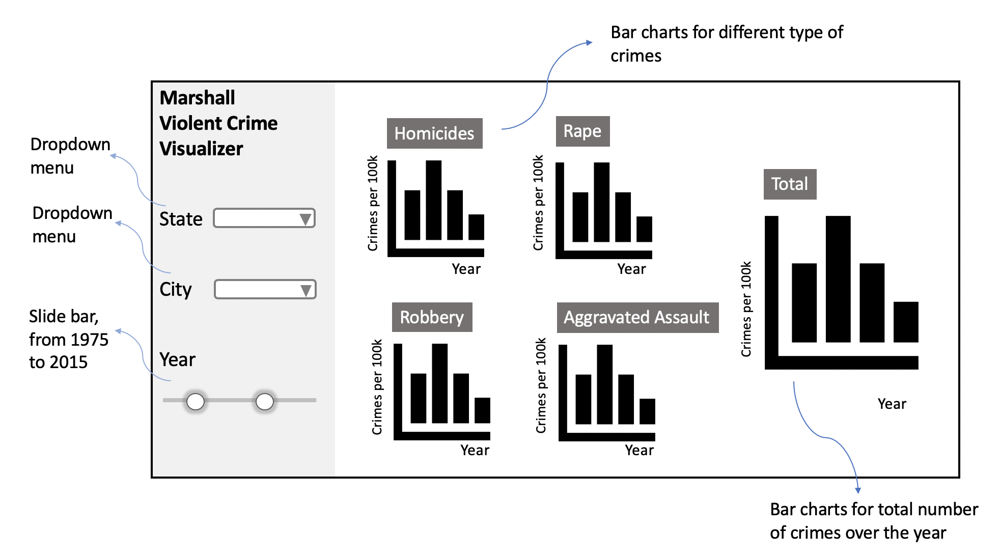

# Crime Visualizer

Team:
- [Gabriel Bogo](https://github.com/GabrielBogo)
- [Olivia Lin](https://github.com/olivia-lin)

# Links for feedback given to other groups:

- [Group 1](https://github.com/UBC-MDS/US_Crime_Trend/issues/8)
- [Group 2](https://github.com/UBC-MDS/mental-health-analysis-and-app/issues/11)

## Proposal

### 1 - Overview

Public safety is one of the main factors impacting the quality of life of citizens. For this reason, it is essential that public authorities have access to historical information on violent crimes so they can devise sound strategy plans and budget allocation to best serve their cities. We propose designing an app that makes the visualization of crime data easier, generating a breakdown of the historical information into states, cities and types of crime.

### 2 - Description of the Data

The app will be based on crime data for 68 US cities, over the period of 1975-2015, covering four types of violent crimes: homicides, rape, robbery and aggravated assault. The data was collected and curated by [The Marshall Project](https://www.themarshallproject.org/) and contains 2830 data points, each one being the crime data for a particular city and year. Each data point has 7 associated variables that describe the demographic information of the data point (year, city, city population), the raw numbers of different crimes (homs_sum, rape_sum, rob_sum, agg_ass_sum), the normalized numbers of different crimes (homs_per_100k, rape_per_100k, rob_per_100k, agg_ass_per_100k), and the number of crimes for all four crime types (violent_crime, violent_per_100k). Using this data we will also derive a new variable, which is the state of each data point.

### 3 - Usage Scenario & Tasks

John Doe is the Secretary of Public Safety and Homeland Security of the State of New Mexico, and is currently dealing with a major political crisis as he is seeing the number of violent crimes skyrocket in the state over the past decade. Being the officer in charge of the Police, he needs to deal with limited budgets, insufficient human resources as well as constant societal pressure. This situation has become a nightmare for him and he needs to provide an immediate response to address the problem. The first step is to improve his understanding of the current situation by being able to visualize crime data in a fast and effective way.

When John Doe logs in the Crime Visualizer, he is able to quickly visualize the yearly evolution of the number of crimes by city, compare it with the average values for different states as well as an aggregate of the whole country. Also, he will have the types of crimes broken down in different graphs, which will enable him to take different measures for different cities according to each one's most critical problems.

### 4 - Description of App & Sketch

The app contains a landing page that shows bar charts of the number of crimes per 100k citizens over the years, broken down into different types of crimes. One extra chart provides an overall picture by summing up all different types of crimes. To zero in on more specific information, filters are available on the left side of the interface, allowing users to partition the data based on a particular location and year range that they are interested in. For example, users can select a specific state from a drop-down list and see the filtered information on the graphs. If users don’t select any state and city, the default is set to be showing the average of all states. Another drop-down list for cities will be updated interactively based on users’ state of choice - it will display only the cities belonging to the state that was selected before. This will improve the user experience, making it easier for them to browse through the multitude of options. If users don’t select a city, the default is set to be showing the average of all cities. From the slider bar input (year), users can select the range of years to display.  Plots are on the right side of the interface. Overall, users can use the app interface to easily visualize the number of crimes for different types, in different regions, assess their yearly evolution and see how they compare among themselves and to global averages.

