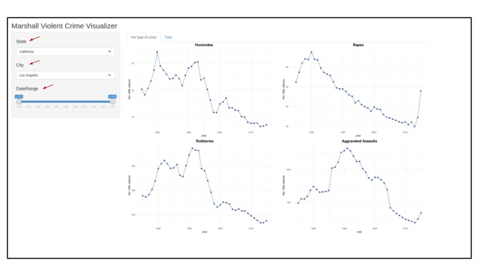
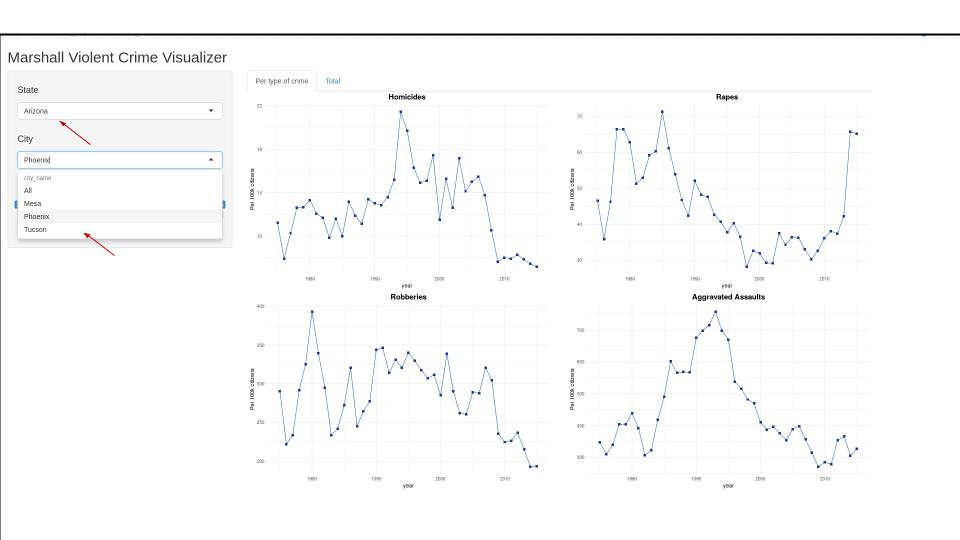
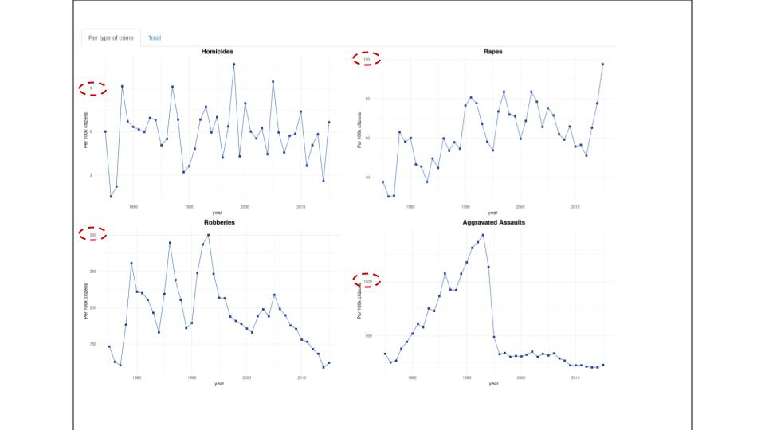
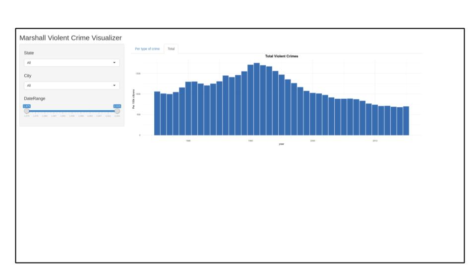
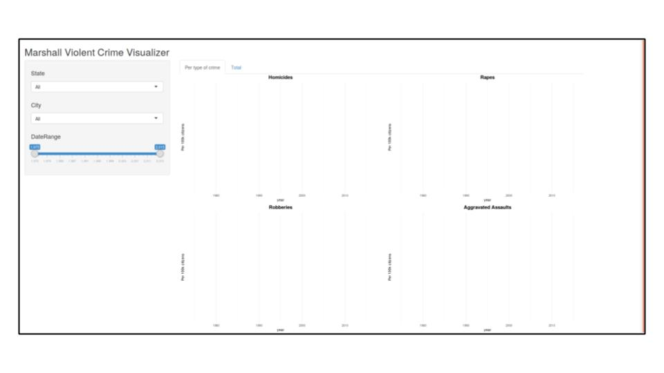

```{r setup, include=FALSE}
knitr::opts_chunk$set(echo = TRUE)
library(here)
knitr::opts_chunk$set(echo = TRUE)
knitr::opts_knit$set(root.dir = here::here())
```


## Milestone Write-up

### Rationale

The app's target users are public leaders who are very busy and usually not analitically trained. For this reason, we chose to be parsimonious with the filter options we wanted to offer. We chose three:   

- State
- City
- Year range



With these filters the user can answer the most relevant questions, such as:  

- Is crime increasing in my city?
- How does my city compare with other nearby cities?
- How does my city compare with the state average?
- How does my city compare with the national average?

Also, to improve the user experience, we implemented a self-updating drop-down list: the cities that show up as options in the filter are only the ones who belong to the chosen state:



Furthermore, we decided to break the crime numbers down into different types of agression (rape, homicide, robbery and aggravated assault). The reason for that is that not only is it insightful to see different types of crime separetely, but also the scales are very different and lumping them all together would probably hide nuances about the phenomenon. Moreover, since the data is a clear time-series, line plot is the best choice of geometry - columns ended up too cluttered and we really wanted to emphasize the trend over time over the absolute value of the indicator.



Still, since we know politicians quite often want simplicity and elegance over analytical accuracy, we created a new tab for the aggregated data, now in a bar chart version. We thought it would be good to give a new perspective on the data, and we also have extra space in the new tab:



### Tasks

In this milestone we completed the following tasks:
 
- [Data Cleaning](../script_clean_data.R)
- Development of a first functional version of the app, fulfilling our proposal [plan](../README.md). The main features were:
  - Filters for state, city and year
  - Dynamic data wrangling, according to the filters
  - Self-updating drop-down list for cities
  - Parametric graph generation using ggplot (only one graph declaration used for multiple crime types)
  - Separate tabe for aggregated data
- Deployment to the [cloud](https://olivia-lin.shinyapps.io/crime_visualizer/), using shinyapp.io.

### Vision and Next Steps

We have three main goals for next week:

 - Bug correction, as per next topic.
 - Graph aesthetics improvements: choice of colors, line width, shape of markers, background color, transparency, axis, grids, labels.
 - App aesthetic improvements: headers and containers for different sections of the app.
 
 As a "nice-to-have" feature, we are considering including a map of the crimes as per the users location of choice.

### Bugs
 The app ran with no problem in our local environment, but when publishing to the cloud the graphs disappear when choosing "States: All, City: All". We could not reproduce the error locally and will have to debug it next week.

  
  
  

