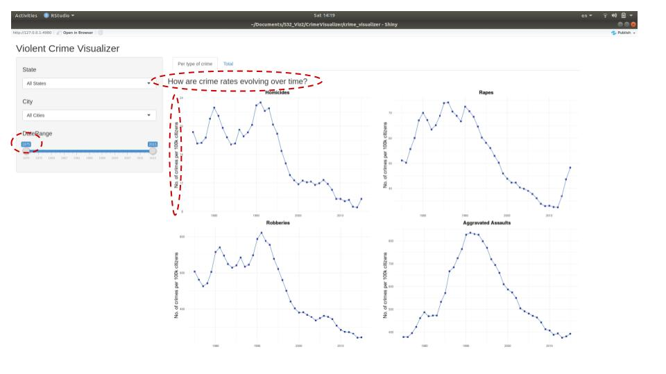
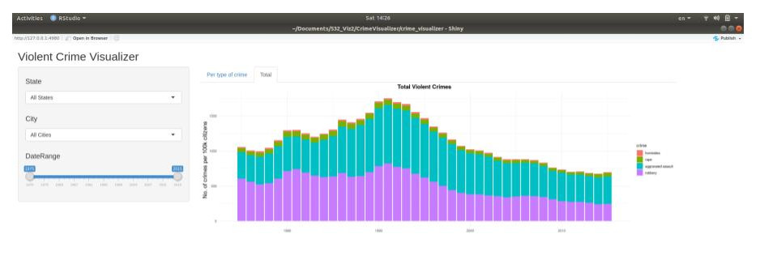

## Milestone 3 Write-up

### Perspectives on the feedback experience

There is clearly no better way to proof-test your app than watching
users using it. And we were satisfied with the experience. All of them
managed to extract the information we wanted to convey, such as:

  - Is crime increasing in my city?
  - How does my city compare to other nearby cities?
  - How does my city compare to the state average?
  - How does my city compare to the national average?

No one got lost or confused with the functionalities of the app.
Success\!

### Feedbacks

The feedbacks were great. One group in particular had very good
technical knowledge of plotting in R and gave us practical tips on how
to quickly improve the aesthetics of the charts. For example, we
reformatted the labels in the Date Range widget, included a suggestive
title and increased the font size of the axes titles, as shown below:



Also, it was them who came up with the idea of improving the usefulness
of the aggregated bar chart by stacking the numbers of each crime type,
instead of merging them all together:



### Bug Correction

The bug from the previous milestone was solved. It was a problem in the
versioning of the dataset. The app is now running with no problem.

### Difficulty in implementing Shiny

Shiny is a simple and fast tool for implementing prototypes. Once you
understand the overall client-server architecture, and as long as you
stick to the basics, Shiny can a very effective tool for exploratory
data analysis, especially if you want to promote discussions with
non-technical people.

Most of the time we spent was on designing elegant pieces of wrangling
and plotting code, that were flexible enough to change according to the
user’s input. It’s clearly easy to write several different blocks of
code, but that is verbose and non-maintenable. Instead, we successfully
managed to write one single block of code for both data wrangling and
plotting, making it much easier to debug, adapt and improve:

> Wrangling code

``` 
  reactive_data <- reactive({
    if (input$state == "All States"){
      cols = c("year", "crime")
    } else if (input$city == "All Cities"){
      cols = c("state_name", "year", "crime")
    } else {
      cols = c("state_name", "city_name", "year", "crime")
    }
    
    clean_data %>%
      filter(year >= input$dateRange[1],
             year <= input$dateRange[2]) %>%
      group_by_at(.vars=vars(cols)) %>% 
      summarize(sum_cases = sum(cases),
                sum_pop = sum(total_pop),
                wa_per_100k = 100000 * sum_cases / sum_pop) %>% 
      when(
        input$state != "All States" & input$city == "All Cities" ~ filter(., state_name == input$state),
        input$state != "All States" & input$city != "All Cities" ~ filter(., state_name == input$state,
                                                                          city_name == input$city),
        ~ .) %>% 
      mutate(crime = fct_reorder(crime, wa_per_100k))
  })
```

> Plotting code

``` 
  for (i in 1:nrow(crime_types)) {
    local({
      c <- crime_types$name[[i]]
      title <- crime_types$title[[i]]
      
      output[[c]] <- renderPlot(
        reactive_data() %>%
          filter(crime == c) %>% 
          ggplot(aes(y = wa_per_100k, x = year)) +
          geom_line(color="#386cb0") +
          geom_point(shape="square", size=2, color="#253494") +
          ggtitle(title) +
          ylab("No. of crimes per 100k citizens") +
          theme_minimal() +
          theme(plot.title = element_text(size = 15, face = "bold")) +
          theme(plot.title = element_text(hjust = 0.5)) + 
          theme(axis.title = element_text(size = 15),
                axis.title.x=element_blank()) 
      )
    })
  }
```

### Summary and Wishlist

Overall, our app is still very similar to what was planned in the
proposal phase and consistent with the end-goals we had in mind. The use
case of the app is still the same and most of the improvements were
related to design and visual aesthetics.

Unfortunately, we could not implement everything we wanted. See below
the features that we left to the wishlist:

  - **Global averages**: it would be interesting to compare the numbers
    of a particular city to the averages in its state or country. We
    could overlay this new line onto the existing plots to promote an
    easy comparison. We did not implement this feature because that
    would require structural changes in the wrangling logic, and too
    much effort had already been put into this area in the project.
  - **Variable chart title**: after the user chooses the state, city and
    year range, we could update the title to reflect these choices. It’s
    redundant since the filters already provide this information, but we
    believe it would still make interpretation easier. However, we
    decided it was not a priority at this moment.
  - **Multiple choices of cities/states**: we could have offered the
    user the choice of selecting multiple cities/states. We decided not
    to add it for now because we were not sure whether the value created
    by this feature would justify the extra complexity in using (and
    maintaining) the app.
