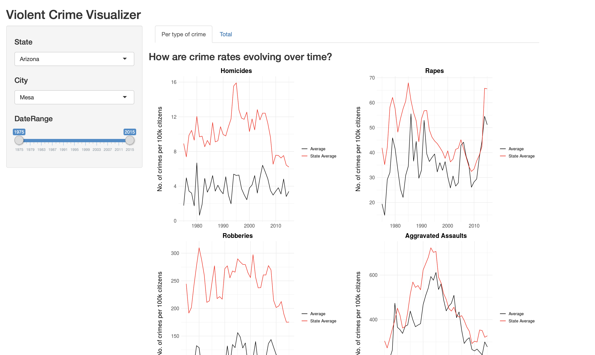

```{r setup, include=FALSE}
knitr::opts_chunk$set(echo = TRUE)
library(here)
knitr::opts_chunk$set(echo = TRUE)
knitr::opts_knit$set(root.dir = here::here())
```

## Milestone 4 Write-up

### Added Feature: Comparing city and state crime statistics

We decided to implement one extra feature: as soon as the user picks a city, we overlay the average crime numbers from the state the city belongs to:  



This feature is very important for our use case: it gives the user a benchmark to assess the relative performance of its city compared to the ones around it.

To implement this feature, we had to tinker with the plots a little bit:  

- Removed the markers on the line plot to make it less cluttered
- Changed the data wrangling to allow for both city and state summary figures
- Wrote one single block of ggplot code that was conditional on the user's input.

### Added Feature: Hover

This feature allows users to hover over the plot to see more details about each data point. It also allows users to zoom in and zoom out. To implement this feature, we change use the `plotly` package.

### Supression of error message

We used to have a error message shown on the graph when loading the landing page because of our if statement. When making plots for the US and each state, `if (input$state != "All States" & input$city != "All Cities")` returns a empty set. Since this is not actually a error, but how the way we design our plot, we decided to change the setting so that this error message doesn't show on our plot.


### Code documentation
As one of our last tasks, we decided to improve the [code](../crime_visualizer/app.R) readibility by adding extra documentation, spacing and overall organization.


### Conclusion
This was a good exercise to explore the functionalities of Shiny. As mentioned before, Shiny is a fantastic tool to create simple and effective visual interactivity, which may come in handy in meetings, discussions or even as a final product to clients. But a few things must be kept in mind before one decides to proceed and invest time in developing a Shiny app:  

- Data wrangling is usually harder: the data wrangling inside a Shiny app can quickly become very complicated, since it will likely be dependent on the user's input. Therefore, to avoid repeated blocks of codes, several if-else statements will have to be embedded into the data wrangling code, making it longer and harder to read.
- Debugging is harder: it's very difficult to run the Shiny app and break in the middle of the runtime as you would do with a regular script. Besides, interactivity relies on Reactive variables, which sometimes cannot be introspected. Therefore, small bugs can take much longer to be debugged, and development time is much larger than it would be were the same analysis to be performed through a regular script.
- Avoid perfectionism: it's very easy to get bogged down on features that may seem critical when in fact they are unnecessary. Shiny is effective when it's used as it was intended by design. Going for non-conventional features may result in painful, and usually avoidable, waste of time.

